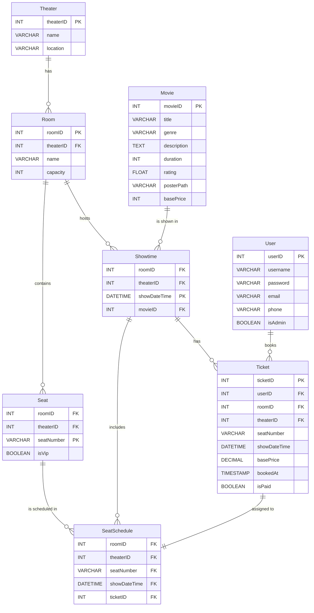

```mermaid
erDiagram

    User {
        INT userID PK
        VARCHAR username
        VARCHAR password
        VARCHAR email
        VARCHAR phone
        BOOLEAN isAdmin
    }

    Movie {
        INT movieID PK
        VARCHAR title
        VARCHAR genre
        TEXT description
        INT duration
        FLOAT rating
        VARCHAR posterPath
        INT basePrice
    }

    Theater {
        INT theaterID PK
        VARCHAR name
        VARCHAR location
    }

    Room {
        INT roomID PK
        INT theaterID FK
        VARCHAR name
        INT capacity
    }

    Seat {
        INT roomID FK
        INT theaterID FK
        VARCHAR seatNumber PK
        BOOLEAN isVip
    }

    Showtime {
        INT roomID FK
        INT theaterID FK
        DATETIME showDateTime PK
        INT movieID FK
    }

    Ticket {
        INT ticketID PK
        INT userID FK
        INT roomID FK
        INT theaterID FK
        VARCHAR seatNumber
        DATETIME showDateTime
        DECIMAL basePrice
        TIMESTAMP bookedAt
        BOOLEAN isPaid
    }

    SeatSchedule {
        INT roomID FK
        INT theaterID FK
        VARCHAR seatNumber FK
        DATETIME showDateTime FK
        INT ticketID FK
    }

    %% Relationships
    Theater ||--o{ Room : "has"
    Room ||--o{ Seat : "contains"
    Room ||--o{ Showtime : "hosts"
    Movie ||--o{ Showtime : "is shown in"
    Showtime ||--o{ Ticket : "has"
    User ||--o{ Ticket : "books"
    Seat ||--o{ SeatSchedule : "is scheduled in"
    Showtime ||--o{ SeatSchedule : "includes"
    Ticket ||--|| SeatSchedule : "assigned to"

```
